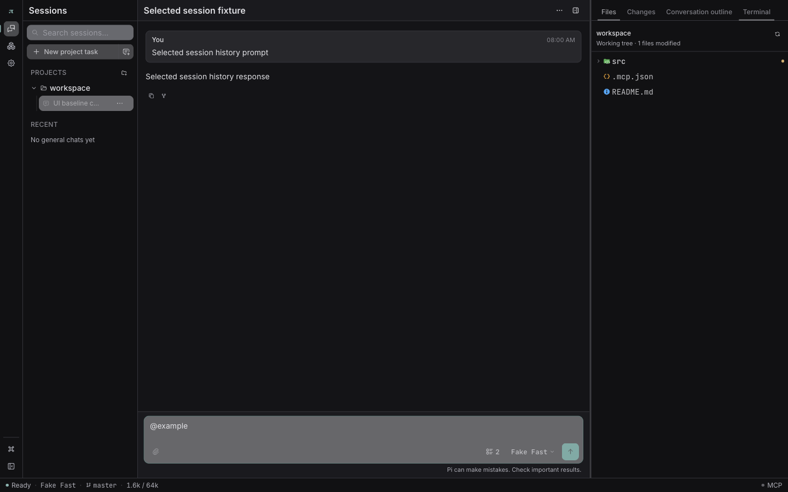

# PiPilot

[English](README.md) | **简体中文**

PiPilot 是基于官方 [Pi coding agent](https://github.com/earendil-works/pi) SDK 的
Electron 桌面客户端。它在项目级 utility process 中运行锁定版本的官方 SDK，展示会话、
工具调用、文件变更、终端、模型、扩展、Skills 和 MCP 配置，不维护另一套 Agent
Runtime，也不把 Pi 的数据迁移成 PiPilot 私有格式。

Pi 继续拥有 Session、配置和资源，PiPilot 负责桌面使用体验。

> **项目状态：**`v0.0.1` 是首个公开版本。源码仓库和 GitHub Release 均公开；未签名
> 安装包只有在原生构建和 packaged smoke 验证通过后才用于手动下载。

[](https://github.com/GarlandQian/PiPilot/actions/workflows/ci.yml)
[](LICENSE)



## 主要能力

- **官方内置 Pi Runtime**：在隔离的 Electron utility process 中运行锁定的官方 Pi
  SDK `0.84.2`，同时保留 Pi 自己的 Session 和配置文件。
- **项目与日常聊天**：项目目录只能由用户明确选择；也支持不绑定项目的聊天，不会把主目录
  自动当作项目。
- **真实 Pi Session**：按项目浏览 Session，并使用已经接入的创建、打开、命名、复制、
  Fork 和删除等 Pi 能力。
- **完整对话体验**：Markdown、代码块、工具调用、Queue、Follow-up、Steer、模型与
  Thinking 控制。
- **Commands、Skills 与上下文**：输入 `/` 搜索 Commands 和 Skills；输入 `@` 引用
  项目文件或 Skill，并支持键盘导航。
- **开发检查面板**：文件树、连续 Changes/Diff、对话大纲和项目终端。
- **Pi 集成管理**：查看和管理 Packages、Resources、Extensions、Skills、Prompts 和
  Themes，并通过受控重启应用变更。
- **MCP 管理**：编辑全局 `~/.pi/agent/mcp.json` 和当前项目 `.mcp.json`；提供结构化
  表单与 Raw JSONC 编辑，并保留注释和未知字段。
- **入站对话 MCP**：在设置页现有 Integrations 标签中明确启用仅本机的 External
  Control，即可通过打包后的 stdio MCP 命令查看有界对话元数据，并向精确对话发送
  Prompt。它默认关闭，使用仅当前用户可访问的 Unix socket 或命名管道，不暴露历史
  Transcript、Token 或 Session 文件路径。
- **模型管理**：管理 Pi `models.json`、自定义 Provider/Model、默认模型和高级 JSON
  字段。
- **桌面体验**：浅色/深色主题、中英文界面、可配置终端字体、键盘操作，以及
  `1100×680` 最小窗口布局。

PiPilot 目前只支持 Electron 桌面应用，不提供 Web 版本。

## 设计原则

1. **Pi 拥有数据，PiPilot 提供体验**：Session、模型、扩展和配置继续使用 Pi 的官方
   文件与目录。
2. **优先使用官方能力**：Pi RPC 已提供的功能直接接入官方协议；PiPilot 不维护平行的
   Agent 实现。
3. **官方 Pi SDK 优先**：PiPilot 使用锁定的公开 Pi SDK，并从标准 Pi 环境加载全局和
   项目级插件、Skills 与资源。
4. **状态真实**：未选择、加载中、可用和错误状态分开呈现；切换 Session 时不展示上一
   Session 的数据。
5. **紧凑桌面工具**：保持安静、克制、高信息密度的开发工具界面，覆盖浅色、深色和最小
   窗口布局。

## 开发环境要求

- macOS、Windows 或 Linux
- Node.js `24.18.0`（项目 CI 使用版本）
- pnpm `11.16.0`（项目 CI 使用版本）

安装包用户不需要 Node.js、pnpm，也不需要另行安装 Pi 可执行文件。开发环境使用
`package.json` 和 `pnpm-lock.yaml` 中精确锁定的 Pi SDK 版本。

## 本地开发

```bash
git clone https://github.com/GarlandQian/PiPilot.git
cd PiPilot
pnpm install --frozen-lockfile
pnpm dev
```

常用检查：

```bash
pnpm typecheck
pnpm test:unit
pnpm build
pnpm test:electron
```

应用由 Electron Main、sandbox preload 和 React renderer 组成。Renderer 不直接访问
Node.js、文件系统或 Pi，跨进程数据通过共享 Zod 契约和白名单 IPC 传递。

## 本地打包

```bash
# 当前平台的未打包目录和 packaged smoke
pnpm package:dir
pnpm test:packaged

# 原生安装包
pnpm package:mac
pnpm package:win
pnpm package:linux
```

当前目标和首版策略：

| 平台 | 架构 | 产物 | 信任与更新策略 |
| --- | --- | --- | --- |
| macOS | arm64、x64 | DMG、ZIP | 无 Developer ID、未公证；手动下载和安装 |
| Windows | x64 | NSIS | 未签名；可能出现 SmartScreen 或未知发布者提示 |
| Linux | x64 | AppImage、DEB | 正在验证 AppImage 更新；DEB 手动安装 |

macOS 首版没有 Apple Developer ID 签名，也没有 notarization。下载后可能需要在 Finder
中右键选择“打开”，或在系统设置中明确允许。Windows 首版没有发布者签名，系统可能显示
SmartScreen 警告。Release 说明和应用会如实展示这些状态。

详细打包边界和最新真实验证状态见 [docs/PACKAGING.md](docs/PACKAGING.md)。

## External Control

External Control 是独立于 Pi 出站 MCP 配置的入站 MCP 边界，默认关闭，可在“设置 >
Integrations”现有标签中启用。PiPilot 可以由用户明确安装或修复稳定的
`pipilot-mcp` 启动器，并显示一份可复制的通用配置：

```json
{
  "mcpServers": {
    "pipilot": {
      "command": "pipilot-mcp",
      "args": []
    }
  }
}
```

能力 Token、打包可执行文件和 descriptor 路径始终只由 Main 持有，不会进入复制的
配置。

stdio 进程不会打开 GUI，也不会监听网络端口，而是通过 macOS/Linux 的当前用户私有
Unix-domain socket，或 Windows 的命名管道连接运行中的 Main。工具型 MVP 提供有界的
对话列表/状态、幂等 Prompt 与 Abort receipt、操作状态以及有界等待；最终响应只会返回
给产生它的那个操作。关闭功能会断开客户端、移除端点并轮换凭据；应用停止或功能关闭时
stdio 会返回有界的 unavailable 错误。macOS/Linux 只会安装到已在 `PATH` 中的安全、
稳定用户目录；Windows 会把打包的 `pipilot-mcp.exe` 所在目录加入当前用户 PATH，并
原样保留 Unicode 与其他 PATH 条目。Windows 首次注册后请注销并重新登录，使之后启动
的客户端继承新环境。经 PiPilot 证明为受管的启动器也可在确认后卸载；卸载不会关闭
External Control，不会删除 Windows 打包可执行文件，只会移除受管 wrapper/receipt 或
PiPilot 加入当前用户 PATH 的那一个条目。PiPilot 不会修改 Codex、Claude Code、Pi、
shell profile 或项目 MCP 配置文件。

## Release 与更新

公开发布流程：

1. 稳定标签（例如 `v0.0.1`）先触发发布专属的完整验证任务。
2. 源码、单元测试、构建、集成和 Electron 检查通过后，macOS、Windows、Linux
   分别完成打包、产物检查和 packaged smoke。
3. 最终装配任务拒绝同名文件覆盖，并校验文件名、版本、SHA-256，以及更新元数据
   引用的安装包大小和 SHA-512。
4. Actions 创建 GitHub Release 草稿，并校验草稿中的完整资产集。
5. 只有完整验证、所有原生构建、packaged smoke、最终装配与草稿资产校验均成功后，
   Release 才会公开。首次仓库重置只允许替换 `v0.0.1`，且标签必须指向仓库唯一的根
   提交；后续发布必须提高版本号。

首个 `0.0.1` 版本需要手动下载安装。PiPilot 不会静默下载或安装更新。macOS 保持手动
下载；Windows/Linux 的原生应用内更新只有在官方 updater 的隔离平台测试通过后才会启用。

## Pi 配置与数据

PiPilot 不扫描磁盘寻找项目，也不会自动把主目录当作项目。项目工作目录只来自系统文件夹
选择器；无项目聊天使用应用私有工作目录，Session 仍由 Pi 存放在官方目录中。

常见 Pi 文件：

- `~/.pi/agent/mcp.json`：全局 MCP 配置
- `<项目>/.mcp.json`：当前项目 MCP 配置
- `~/.pi/agent/models.json`：自定义 Provider 与 Model
- `~/.pi/agent/settings.json`：Pi 全局设置与默认模型
- `~/.pi/agent/sessions/`：Pi 官方 Session

请不要把包含 API Key、Token 或真实 Session 内容的个人配置提交到仓库。

## 项目结构

```text
src/main/       Electron Main、Pi Runtime、文件、终端和配置服务
src/preload/    sandbox preload 与严格 IPC facade
src/shared/     跨进程 Zod 契约和领域类型
src/renderer/   Renderer adapters、projectors 与纯逻辑
src/components/ React UI
src/store/      Renderer providers 与状态所有者
tests/          Unit、Electron、integration 与 packaged smoke
.trellis/       项目规范、任务和协作工作流
```

## 当前开发重点

- 在 macOS、Windows 和 Linux 实机验证首个公开安装包。
- 继续完善多 Pi Session Runtime 管理和 External Control 操作归属。
- 继续使用内置官方 Pi SDK 验证 Models、Integrations、入站/出站 MCP 和扩展 UI。

## 贡献

修改项目前请阅读 [AGENTS.md](AGENTS.md) 和 `.trellis/spec/` 中对应层的规范。项目使用 pnpm
和冻结的 lockfile；不要提交本机 Skill 软链接、用户 Session、密钥、构建输出或测试报告。

## 许可证

[MIT](LICENSE)
